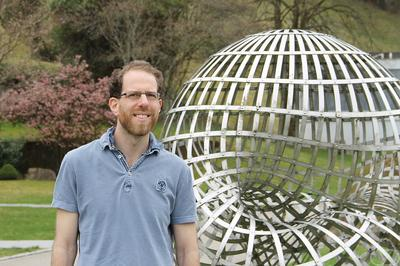
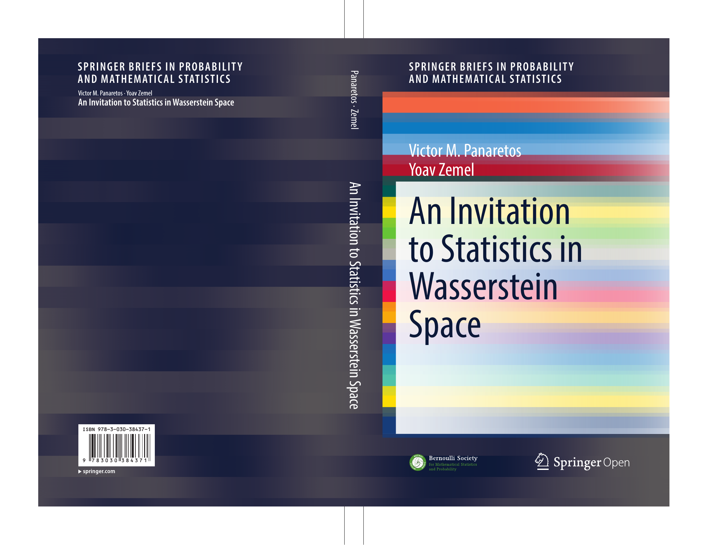

# yoavzemel.github.io

  <html>    
      <head>      
<title>Yoav Zemel</title>
      </head>    
      <body>      
         
Yoav Zemel
    

     
  

      

      
      

I am a Research Associate at the <a class="link-extern" href="http://www.statslab.cam.ac.uk/" rel="noreferrer noopener" target="_blank">Statistical Laboratory</a>, mentored by <a class="link-extern" href="http://www.statslab.cam.ac.uk/~rjs57/" rel="noreferrer noopener" target="_blank">Professor Richard Samworth</a>.

I am also College Research Associate at <a class="link-extern" href="http://www.magd.cam.ac.uk" rel="noreferrer noopener" target="_blank">Magdalene College</a>.

Statistical Laboratory, Centre for Mathematical Sciences, Wilberforce Road, Cambridge CB3 0WB.

Room D0.20 (Pavillion D)

lastname@statslab.cam.ac.uk (replace the first 8 characters by my surname)

(+44) 01223 339792

<h2>Short Biography</h2>
<table class="content table">
  <tbody><tr><td class="special">2007-2010</td>
<td class="special">B.Sc. in mathematics and economics, Hebrew University of Jerusalem, <em>summa cum laude</em></td>
</tr><tr><td class="special">2010-2012</td>
<td class="special">M.Sc. in applied mathematics, orientated in Statistics and Financial Mathematics, École polytechnique fédérale de Lausanne</td>
</tr><tr><td class="special">2012-2017</td>
<td class="special">PhD, École polytechnique fédérale de Lausanne, advised by Professor <a class="link-extern" href="http://smat-files.epfl.ch/victor/" rel="noreferrer noopener" target="_blank">Victor M. Panaretos</a></td>
</tr><tr><td class="special">2017</td>
<td class="special">Postdoctoral researcher, École polytechnique fédérale de Lausanne</td>
</tr><tr><td class="special">2018-2019</td>
<td class="special">SNSF Early Postdoc.Mobility Fellow, Georg-August-Universität Göttingen, mentored by Professor <a class="link-extern" href="http://www.stochastik.math.uni-goettingen.de/index.php?language=en&amp;id=munk" rel="noreferrer noopener" target="_blank">Axel Munk</a></td>
</tr></tbody></table>

<h2>Book (open access!)</h2>
<table><tr>
<td></td>
<td>
Panaretos, V. M. &amp; <u><strong>Zemel, Y.</strong></u> (2020) 
<a class="link-extern" href="https://www.springer.com/gp/book/9783030384371" rel="noreferrer noopener" target="_blank">An Invitation to Statistics in Wasserstein Spaces</a> <em>Springer Briefs in Probability &amp; Mathematical Statistics</em>.
</td>
</tr></table>
The above link points to the publisher website.  See also the <a href = "isw/isw.html">dedicated page</a>.
<h2> </h2>
<h2>Publications and preprints</h2>
Also available on my <a href="https://scholar.google.com/citations?user=0NyTBEYAAAAJ&hl=de&oi=ao">Google Scholar profile</a>.

  Heinemann, F., Munk, A., &amp; <u><strong>Zemel, Y.</strong></u> (2022) 
  <a class="link-extern" href="https://doi.org/10.1137/20M1385263" rel="noreferrer noopener" target="_blank">Randomised Wasserstein barycenter computation: Resampling with statistical guarantees.</a> <em>SIAM Journal of Mathematics of Data Science</em> <strong>4</strong>(1):229-259.  The accompanying <b>R</b> package <b>WSGeometry</b> is available from <a class="link-extern" href="https://CRAN.R-project.org/package=WSGeometry" rel="noreferrer noopener" target="_blank">CRAN</a>
  

  Klatt, M., Munk, A., &amp; <u><strong>Zemel, Y.</strong></u> (2020+) 
  <a class="link-extern" href="https://arxiv.org/abs/2007.13473" rel="noreferrer noopener" target="_blank">Limit laws for empirical optimal solutions in stochastic linear programs.</a> <em>Annals of Operations Research, in press</em>
  

  Galasso, B., <u><strong>Zemel, Y.</strong></u> &amp; de Carvalho, M. (2018+) 
  <a class="link-extern" href="https://arxiv.org/abs/1812.09607" rel="noreferrer noopener" target="_blank">Bayesian semiparametric modelling of phase-varying point processes.</a> <em>Electronic Journal of Statistics (in press)</em>. The accompanying <b>R</b> package <b>Rmpp</b> is available from <a class="link-extern" href="https://github.com/bgalasso/Rmpp" rel="noreferrer noopener" target="_blank">GitHub</a>
  

 

<u><strong>Zemel, Y.</strong></u>  &amp; Panaretos, V. M. (2019) <a class="link-extern" href="https://projecteuclid.org/euclid.bj/1551862840" rel="noreferrer noopener" target="_blank">Fréchet Means and Procrustes Analysis in Wasserstein Space.</a> <em>Bernoulli</em> <strong>25</strong>(2):932-976

  Masarotto, V., Panaretos, V. M. &amp; <u><strong>Zemel, Y.</strong></u> (2019) 
  <a class="link-extern" href="https://link.springer.com/article/10.1007%2Fs13171-018-0130-1" rel="noreferrer noopener" target="_blank">Procrustes metrics on covariance operators and optimal transportation of Gaussian processes.</a> 
  <em>Invited paper, Special Issue on Manifold Statistics, Sankhya A </em><strong>81</strong>(1):172-213
  

  Panaretos, V. M. &amp; <u><strong>Zemel, Y.</strong></u> (2019) 
  <a class="link-extern" href="https://www.annualreviews.org/doi/abs/10.1146/annurev-statistics-030718-104938?journalCode=statistics" rel="noreferrer noopener" target="_blank">Statistical Aspects of Wasserstein Distances</a>. 
<em>Annual Review of Statistics and its Applications</em> <strong>6</strong>:405-431

Sommerfeld, M., Schrieber, J., <u><strong>Zemel, Y.</strong></u> &amp; Munk, A. (2019) 
<a class="link-extern" href="http://www.jmlr.org/papers/v20/18-079.html" rel="noreferrer noopener" target="_blank">Optimal Transport:  Fast probabilistic Approximation with Exact Solvers.</a> 
<em>Journal of Machine Learning Research </em><strong>20</strong>(105):1-23

  Henshaw, J. M. &amp; <u><strong>Zemel, Y.</strong></u> (2017) 
  <a class="link-extern" href="http://onlinelibrary.wiley.com/doi/10.1111/2041-210X.12685/full" rel="noreferrer noopener" target="_blank">A unified measure of linear and nonlinear selection on quantitative traits.</a> 
  <em>Methods in Ecology and Evolution</em> <strong>8</strong>(5):604-614 
This paper won the <a class="link-extern" href="https://www.britishecologicalsociety.org/publications/best-paper-by-an-early-career-researcher/robert-may-prize/" rel="noreferrer noopener" target="_blank">Robert May Prize,</a> awarded to the first author by convention. 
<b>R</b> code available on <a class="link-extern" href="https://github.com/jjono/DSD" rel="noreferrer noopener" target="_blank">GitHub</a>

  Panaretos, V. M. &amp; <u><strong>Zemel, Y.</strong></u> (2016) 
<a class="link-extern" href="http://projecteuclid.org/euclid.aos/1458245735" rel="noreferrer noopener" target="_blank">Amplitude and phase variation of point processes</a>. 
<em>The Annals of Statistics</em> <strong>44</strong>(2):771-812 
The accompanying <b>R</b> package <b>Rmpp</b> is available from <a class="link-extern" href="https://github.com/bgalasso/Rmpp" rel="noreferrer noopener" target="_blank">GitHub</a> 

<h2>Other publications</h2>

  <strong><u>Zemel, Y.</u></strong> (2020) 
Discussion on <a class="link-extern" href="https://rss.onlinelibrary.wiley.com/doi/10.1111/rssb.12337">"Functional models for time-varying random objects"</a> by P. Dubey &amp; H.-G. M&uuml;ller. 
  <em>Journal of the Royal Statistical Society, Series B</em> <strong>82</strong>(2):316  

 

<h2><a name="t">Teaching</a></h2>
        
 September 2018: <em>Stochastisches Praktikum</em>, an R lab course for 3rd year B.Sc. students, G\"ottingen, Germany

 Lent 2020: <a href="tst/tst.html" rel="noreferrer noopener" target="_blank">Topics in Statistical Theory</a>

 February 2021: Short course on optimal transport at the Swiss Doctoral School in Statistics and Applied Probability (online)

 September 2022: Short course on optimal transport at YES workshop, Eindhoven, the Netherlands

 Fall 2022: Probability and statistics for civil and and material and science engineering

        
 Spring 2023: Statistics for mathematicians

    

      </body>
</html>
